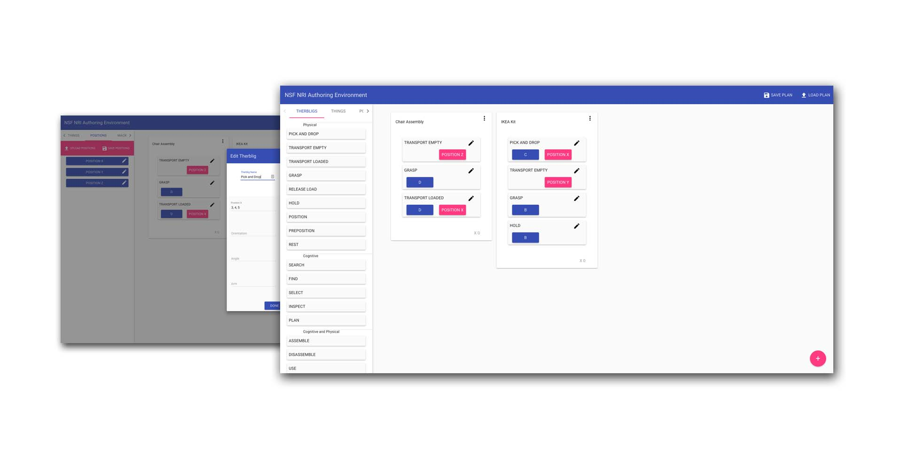

# The NSF NRI Robot Task Authoring Environment

An [interface](https://github.com/abhay-venkatesh/NRI-authoring-UI) for creating robot tasks under [Dr. Bilge Mutlu](http://bilgemutlu.com/) in collaboration with the [MIT Interactive Robotics Group](https://interactive.mit.edu/). We define "therbligs" as the atomic task units, and then compose them to create various actions. 
